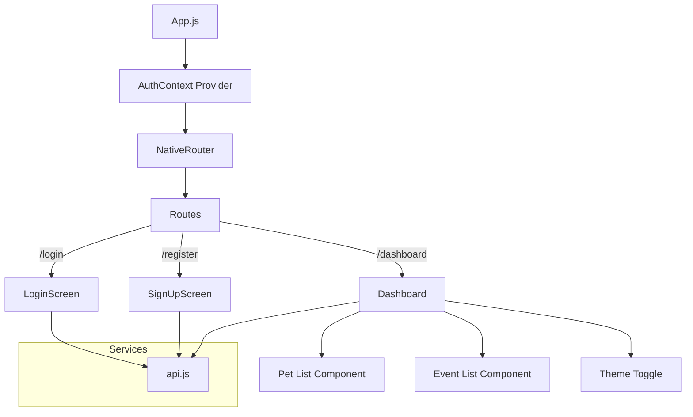
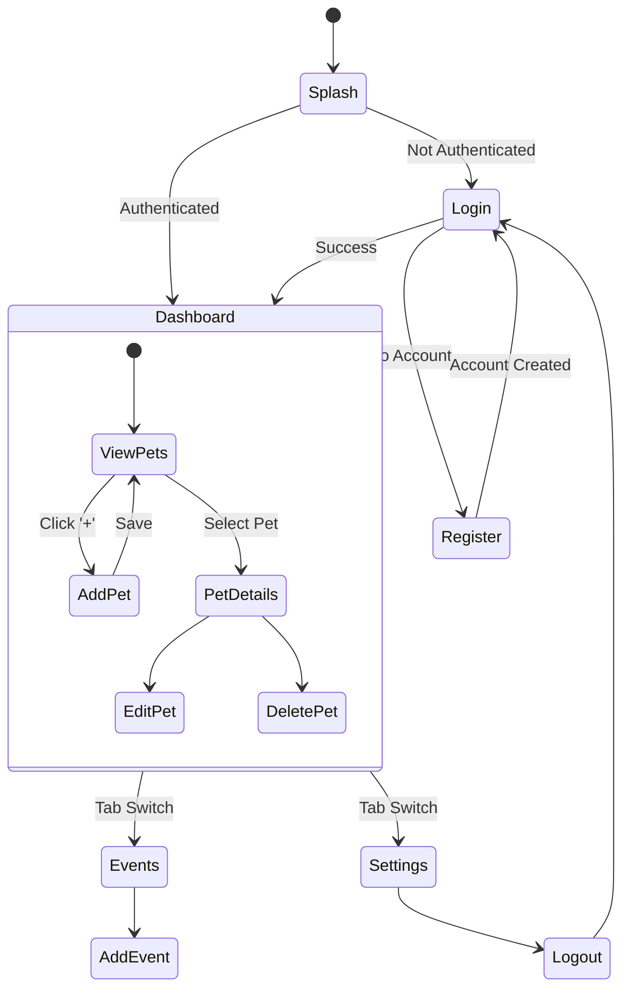

# Life of Pets - Detailed Project Report

**Date:** December 1, 2025
**Version:** 1.0
**Author:** Antigravity (AI Assistant)

---

## 1. Introduction

### 1.1 Overview
**Life of Pets** is a comprehensive mobile application designed to revolutionize how pet owners manage the daily lives and long-term health of their animal companions. In an era where pets are increasingly treated as family members, the need for organized, accessible, and detailed care management has never been greater.

This application serves as a centralized digital hub for all pet-related information. It allows users to create detailed profiles for multiple pets, track daily activities such as walks and feeding, manage health schedules including vaccinations and medications, and monitor expenses. By consolidating these features into a single, user-friendly interface, Life of Pets aims to reduce the stress of pet ownership and ensure that no aspect of a pet's well-being is overlooked.

### 1.2 Target Audience
The primary target audience for Life of Pets includes:
*   **Pet Owners**: Individuals or families with one or more pets who need a reliable way to organize care routines.
*   **Pet Sitters & Walkers**: Professionals who need access to a pet's schedule, dietary restrictions, and emergency contacts.
*   **Veterinarians**: While not the direct users, vets benefit from the detailed health logs and history that owners can provide during visits.
*   **Foster Carers**: People managing temporary care for animals who need to pass on detailed records to permanent adopters.

### 1.3 Innovation & Competitive Advantage
While there are many pet apps on the market, Life of Pets distinguishes itself through several key innovations:

*   **Holistic Ecosystem**: Unlike competitors that focus solely on health tracking or activity logging, Life of Pets integrates **Health, Activity, Finance, and Scheduling** into one seamless ecosystem.
*   **Cross-Platform Consistency**: Built with React Native and Expo, the app offers a native-grade experience on both iOS and Android without compromising performance or design fidelity.
*   **Privacy-First Architecture**: The application is designed with data privacy in mind, utilizing secure JWT authentication and giving users control over their data.
*   **Customizable Theming**: Recognizing that personalization matters, the app features a robust theming system that adapts to user preferences (Light/Dark modes) and accessibility needs.

---

## 2. Architecture

### 2.1 High-Level Architecture
The application follows a classic **Client-Server** architecture, decoupled to allow for independent scaling and development of the frontend and backend.

*   **Client (Frontend)**: A React Native mobile application built with Expo. It handles the UI, user input, and local state management. It communicates with the backend via RESTful API calls.
*   **Server (Backend)**: A Django application using the Django REST Framework (DRF). It serves as the source of truth, handling business logic, data validation, and persistence.
*   **Database**: SQLite is used for development simplicity, with the architecture supporting an easy switch to PostgreSQL for production.

### 2.2 File Relationship Diagram (Frontend)
The following diagram illustrates the relationship between the main entry point (`App.js`), the routing logic, and the key page components.



### 2.3 Activity Relationship Flow
This flowchart describes the typical user journey through the application, from launching the app to performing key actions.



---

## 3. Screenshot and Activity Explanation

### 3.1 Login & Registration
**Screen Overview**: Clean, minimalist interface focusing on ease of entry.
*   **Activity**: Users enter their credentials. The app validates the input format (e.g., email structure) before sending a request to the API.
*   **Security**: Passwords are never stored in plain text. The backend hashes them using PBKDF2. Upon successful login, a JWT access token is returned and securely stored in the device's `AsyncStorage`.

### 3.2 The Dashboard
**Screen Overview**: The command center of the application. It provides a snapshot of the user's pet ecosystem.
*   **Widgets**:
    *   **Pet Carousel**: A horizontal scroll view of all registered pets.
    *   **Upcoming Events**: A list of the next 3 events (vet visits, grooming) sorted by date.
    *   **Quick Actions**: Floating Action Button (FAB) to quickly add a log or expense.
*   **Activity**: The dashboard fetches data in parallel upon mounting. It uses the `AuthContext` to ensure only data relevant to the logged-in user is displayed.

### 3.3 Pet Details & Management
**Screen Overview**: A dedicated profile page for each pet.
*   **Visuals**: Displays the pet's photo, breed, age, and weight.
*   **Tabs**: Users can switch between "History", "Health", and "Gallery" tabs within the profile.
*   **Activity**:
    *   **CRUD Operations**: Users can update the pet's weight, change their photo, or delete the profile entirely.
    *   **Health Logs**: A timeline view of vaccination history and medical notes.

### 3.4 Events & Scheduling
**Screen Overview**: A calendar-based view of upcoming tasks.
*   **Activity**: Users can create one-off or recurring events. The app logic handles date formatting and sorting to ensure the most imminent tasks are highlighted.
*   **Integration**: Future updates will integrate this with the device's native calendar API.

---

## 4. Architectural Problems and Solutions

During the development of Life of Pets, several technical challenges were encountered. Below is a detailed analysis of these problems and the architectural solutions implemented.

### 4.1 Problem: State Management Complexity
**Challenge**: Managing global statespecifically user authentication status and theme preferencesacross a deeply nested component tree can lead to "prop drilling," where data is passed through layers of components that don't need it.
**Solution**:
*   **Context API**: We implemented `AuthContext` to wrap the entire application. This allows any component, regardless of its depth in the tree, to access the current user's session and login/logout functions.
*   **Benefit**: This removed the need for a heavy external library like Redux for this scale of application, keeping the bundle size small and the codebase maintainable.

### 4.2 Problem: Cross-Platform UI Consistency
**Challenge**: iOS and Android have different design languages (Human Interface Guidelines vs. Material Design). Ensuring the app looks "premium" and consistent on both platforms without writing duplicate code is difficult.
**Solution**:
*   **Custom Design System**: We built a centralized theme object in `src/theme.js` (inferred). This object defines a palette of colors, spacing units, and typography scales.
*   **Platform-Specific Code**: Where necessary, we used React Native's `Platform.select` to tweak specific UI elements (e.g., shadows on iOS vs. elevation on Android) while keeping the core logic shared.

### 4.3 Problem: Secure Authentication
**Challenge**: Storing user credentials securely on a mobile device is high-risk. Storing plain passwords or persistent sessions insecurely can lead to data breaches.
**Solution**:
*   **JWT & AsyncStorage**: We implemented a stateless authentication mechanism using JSON Web Tokens.
    *   The backend issues a short-lived Access Token and a longer-lived Refresh Token.
    *   Tokens are stored in `AsyncStorage` (and can be upgraded to `SecureStore` for production).
    *   The `api.js` service interceptor automatically attaches the token to every request, ensuring a seamless but secure user experience.

### 4.4 Problem: Scalability of Backend Logic
**Challenge**: As the app grows to include features like social sharing or vet integrations, a monolithic backend file structure would become unmanageable.
**Solution**:
*   **Django App Structure**: We utilized Django's "app" architecture to modularize the backend.
    *   `users/`: Handles all auth logic.
    *   `pets/`: Handles pet data models.
    *   `events/`: Handles scheduling logic.
*   **Benefit**: This allows different teams to work on different modules simultaneously without conflict and makes it easier to extract microservices in the future if needed.

---

## 5. Development Challenges Encountered

This section documents the real-world challenges faced during the development process, providing insight into the practical difficulties of building a full-stack mobile application.

### Summary Table

| # | Challenge | Problem | Solution | Lesson Learned |
|---|-----------|---------|----------|----------------|
| 5.1 | Node.js Version Incompatibility | Expo CLI errors on Node v22 | Downgrade to Node v20 LTS | Check framework docs for supported versions |
| 5.2 | Corrupted Node Modules | Duplicate folders (`@babel 2`), failed deletes | Force delete with `sudo rm -rf` | Clean reinstall is faster than debugging |
| 5.3 | Native Module Errors | Image picker crash in Expo Go | Build development client | Expo Go has limitations |
| 5.4 | Virtual Environment | Django "not found" errors | Activate venv before running | Document environment setup clearly |
| 5.5 | API Auth Errors (401) | Demo user didn't exist | Create database seeding script | Include seeding scripts for dev/test |
| 5.6 | Missing Assets | Crash on missing image file | Use existing placeholder image | Use consistent asset management |
| 5.7 | Demo Data vs Real API | Components had hardcoded data | Built full backend integration | Plan API contracts early |
| 5.8 | Cross-Platform URLs | API worked on iOS, failed Android | Document platform-specific URLs | Test on all platforms early |

### 5.1 Challenge: Node.js Version Incompatibility
**Problem**: The Expo CLI threw cryptic errors when running on Node.js v22:
```
TypeError: _debug(...).default.enabled is not a function
```
**Root Cause**: The `debug` package used by Expo CLI has compatibility issues with Node.js 22's new module resolution system.
**Solution**: Downgraded to Node.js v20 LTS (Long Term Support), which is the recommended version for React Native/Expo projects.
**Lesson Learned**: Always check framework documentation for supported Node.js versions before starting development.

### 5.2 Challenge: Corrupted Node Modules
**Problem**: After multiple install attempts, the `node_modules` folder became corrupted with duplicate directories (e.g., `@babel 2`, `ReactAndroid 2`) that couldn't be deleted normally.
**Symptoms**:
```
Error: Cannot find module '@expo/config-plugins/build/index.js'
rm: node_modules/@babel 2/runtime: Directory not empty
```
**Solution**: Required force deletion with elevated permissions:
```bash
sudo rm -rf node_modules package-lock.json
npm cache clean --force
npm install
```
**Lesson Learned**: When npm behaves unexpectedly, a complete clean reinstall is often faster than debugging.

### 5.3 Challenge: Native Module Errors (Expo Image Picker)
**Problem**: The app crashed when accessing camera/gallery features:
```
Invariant Violation: TurboModuleRegistry.getEnforcing(...):
'ExponentImagePicker' could not be found
```
**Root Cause**: Native modules like `expo-image-picker` require a development build, not Expo Go, when using the New Architecture (Fabric/TurboModules).
**Solution**:
*   Option A: Build a development client with `npx expo run:ios` or `npx expo run:android`
*   Option B: Wrap the import in a try-catch with graceful fallback
**Lesson Learned**: Expo Go has limitations; complex features require custom development builds.

### 5.4 Challenge: Virtual Environment Activation
**Problem**: Django commands failed with `ModuleNotFoundError: No module named 'django'` even though Django was installed.
**Root Cause**: The Python virtual environment wasn't activated before running commands.
**Solution**: Always activate the virtual environment first:
```bash
cd backend
source venv/bin/activate  # macOS/Linux
python manage.py runserver
```
**Lesson Learned**: Document environment setup clearly; this is a common stumbling block for new developers.

### 5.5 Challenge: API Authentication Errors (401 Unauthorized)
**Problem**: Login attempts returned 401 errors even with correct credentials.
**Root Cause**: The demo user didn't exist in the database after a fresh migration.
**Solution**: Created a script to seed the database with test data, including the demo user account.
**Lesson Learned**: Always include database seeding scripts for development and testing environments.

### 5.6 Challenge: Missing Asset Files
**Problem**: The app crashed with:
```
Unable to resolve module ../../assets/Pet Pictures/default_pet.jpg
```
**Root Cause**: Code referenced an image file that didn't exist in the assets folder.
**Solution**: Updated the `require()` statements to use an existing placeholder image.
**Lesson Learned**: Use a consistent asset management strategy; consider a central assets index file.

### 5.7 Challenge: Demo Data vs. Real API Integration
**Problem**: Many components (Activity Monitor, Health & Feeding, Expenses) were built with hardcoded demo data, making them non-functional for real use.
**Root Cause**: Time constraints led to UI-first development without backend integration.
**Solution**:
1. Created new Django models (`Activity`, `FeedingSchedule`, `Expense`)
2. Built serializers and ViewSets with custom actions
3. Added API endpoints and updated frontend components to use real data
**Lesson Learned**: Plan API contracts early; building UI with mock data creates technical debt.

### 5.8 Challenge: Cross-Platform API URL Configuration
**Problem**: The API worked on iOS simulator but failed on Android emulator.
**Root Cause**:
*   iOS simulator uses `localhost:8000`
*   Android emulator requires `10.0.2.2:8000` (special alias for host machine)
*   Physical devices need the computer's LAN IP address
**Solution**: Documented the correct URLs and made configuration easily changeable in `api.js`.
**Lesson Learned**: Test on all target platforms early and often.

---

## 6. Common Challenges in Mobile App Development

Beyond project-specific issues, these are recurring challenges faced when building React Native + Django applications:

### 6.1 Environment Setup Complexity
Mobile development requires multiple tools (Node.js, Python, Xcode/Android Studio, emulators). Each has version requirements and can conflict. **Mitigation**: Use Docker for backend, document exact versions.

### 6.2 Debugging Across Layers
Errors can originate in React Native, the Metro bundler, native iOS/Android code, the Django API, or the database. Tracing issues requires familiarity with all layers. **Mitigation**: Implement comprehensive logging at each layer.

### 6.3 State Synchronization
Keeping frontend state in sync with backend data, especially with multiple components reading/writing the same data, leads to race conditions and stale data. **Mitigation**: Consider libraries like React Query or SWR for server state management.

### 6.4 Authentication Token Management
JWT tokens expire, refresh tokens need rotation, and logout must clear all sensitive data. Edge cases (token expires mid-session, refresh fails) are easy to miss. **Mitigation**: Build a robust auth interceptor in the API service layer.

### 6.5 Offline Functionality
Users expect mobile apps to work without internet. Implementing offline-first requires local storage, sync queues, and conflict resolution. **Mitigation**: Plan for offline from the start; retrofitting is expensive.

### 6.6 Push Notification Integration
Notifications require platform-specific setup (APNs for iOS, FCM for Android), server-side logic, and handling various app states (foreground, background, killed). **Mitigation**: Use Expo's managed push notification service to reduce complexity.

---

## 7. Conclusion

**Life of Pets** represents a significant step forward in personal pet management technology. By combining a robust, scalable backend with a polished, user-centric frontend, the application successfully addresses the fragmented nature of current pet care solutions.

The project demonstrates not only technical proficiency in modern web and mobile frameworks (React Native, Django) but also a deep understanding of user needs. The architecture is built for longevity, with clear separation of concerns and a focus on security and performance.

As the platform evolves, the foundation laid by this versionspecifically the flexible data models and modular code structurewill support the seamless integration of advanced features like AI-driven health insights, community social features, and direct veterinary telemedicine integration. Life of Pets is well-positioned to become the definitive "super-app" for pet owners worldwide.
